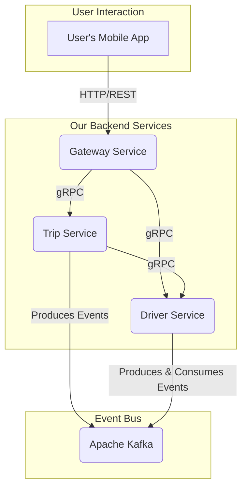
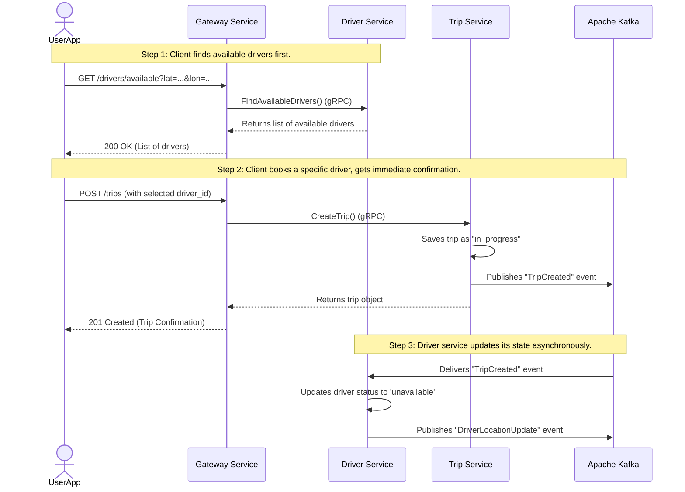
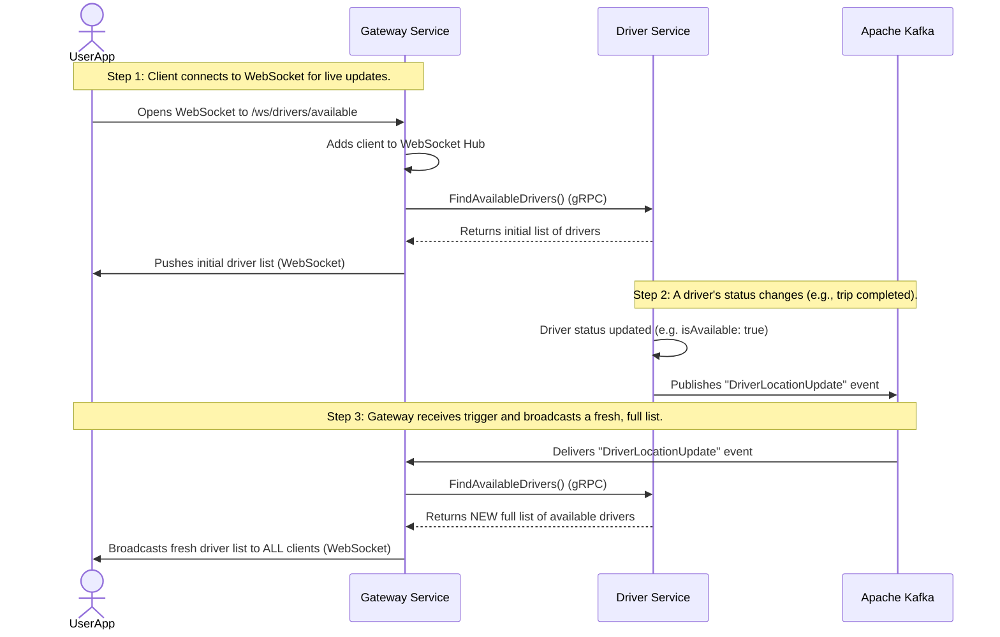

## Building a Scalable Uber-like Application with Go, gRPC, and Kafka

Embarking on the development of a ride-sharing application using a modern, scalable backend architecture is a robust undertaking. This guide provides a high-level overview, a recommended project structure, and initial steps to build your Uber-like application using:

- **Go** for microservices
- **gRPC** for inter-service communication
- **Kafka** for event-driven processing
- **Tilt**, **Minikube**, and **Kubernetes** for a cloud-native development environment

---

### Core Technology Overview

Here's a brief look at the role of each component in your technology stack:

- **Go (Golang):** Simplicity, high performance, and excellent support for concurrency make it a strong choice for scalable microservices.
- **gRPC:** High-performance, open-source universal RPC framework for synchronous, efficient, and strongly-typed communication between internal microservices.
- **Apache Kafka:** Distributed event streaming platform for asynchronous communication and central event processing (e.g., trip requests, location updates).
- **API Gateway:** Single entry point for all client requests; handles authentication, rate limiting, and routing to backend services.
- **Kubernetes (k8s):** Container orchestration platform for deploying, scaling, and managing microservices in a production-like environment.
- **Minikube:** Run a single-node Kubernetes cluster locally for development and testing.
- **Tilt.dev:** Automates and optimizes the development workflow for multi-service applications on Kubernetes, providing smart rebuilds and live updates.

---

### Proposed Microservices

For a simplified start, focus on three core services:

- **Gateway Service:** Public-facing entry point. Exposes a REST or GraphQL API for client applications (rider and driver apps) and translates requests into gRPC calls to internal services.
- **Driver Service:** Manages driver-related data and logic (profiles, availability, location updates).
- **Trip Service:** Handles the lifecycle of a trip, from creation and driver matching to managing ongoing trip status.

---

### Project Structure

```text
/uber-clone
├── api/
│   └── proto/
│       ├── driver/
│       │   └── v1/
│       │       └── driver.proto
│       ├── trip/
│       │   └── v1/
│       │       └── trip.proto
│       └── gateway/
│           └── v1/
│               └── gateway.proto
├── cmd/
│   ├── gateway/
│   │   └── main.go
│   ├── driver/
│   │   └── main.go
│   └── trip/
│       └── main.go
├── internal/
│   ├── driver/
│   │   ├── handler/
│   │   ├── service/
│   │   └── repository/
│   ├── trip/
│   │   ├── handler/
│   │   ├── service/
│   │   └── repository/
│   └── gateway/
│       ├── handler/
│       └── service/
├── pkg/
│   └── models/
├── configs/
├── scripts/
├── Tiltfile
├── docker-compose.yaml
└── go.mod
```

---

### Folder Breakdown

- **api/proto:** Protocol Buffer (`.proto`) files defining gRPC services and message types. Version your API from the start (e.g., `v1`).
- **cmd:** Entry points for each microservice. Each `main.go` initializes and starts its respective service.
- **internal:** Private application and library code. The Go compiler prevents external imports from this directory. Each service has its own subdirectory containing core logic.
  - **handler:** gRPC server implementations handling incoming requests.
  - **service:** Business logic for each service.
  - **repository:** Data persistence and database abstraction.
- **pkg:** Shared code across microservices (e.g., common data models).
- **configs:** Configuration files for your services.
- **scripts:** Utility scripts (e.g., build or deployment).
- **Tiltfile:** Configures Tilt to manage your local development environment.
- **docker-compose.yaml:** Spins up external dependencies like Kafka and Zookeeper for local development.
- **go.mod:** Go modules file for managing project dependencies.

## Diagrams

### High-Level System Architecture



- The User's App only ever talks to the Gateway Service using standard HTTP. It's the single front door to our system.
- The Gateway acts as a translator, converting HTTP requests into internal gRPC calls to the other services.
- The Trip Service and Driver Service communicate with each other directly using gRPC for urgent commands.
- Both the Trip and Driver services also communicate asynchronously by sending events to Kafka. This allows them to announce state changes without being tightly coupled.

### User Story - Booking a Trip

This is the most important and complex flow. It beautifully demonstrates the hybrid use of both gRPC and Kafka to provide a fast user experience while maintaining a resilient system.



### Fast Path vs. Slow Path Explained

**Fast Path (Steps 1–7):**  
This sequence occurs in real time while the user waits for a response.

1. The user's request is sent to the Gateway Service, which forwards it to the Trip Service via a fast gRPC call.
2. The Trip Service needs to find a driver immediately, so it makes a synchronous gRPC call to the Driver Service.
3. The Driver Service responds with a list of the closest available drivers.
4. Instead of directly updating the driver status, the Trip Service publishes a `TripCreated` event to Kafka. This "fire-and-forget" action is extremely fast and decouples the services.
5. The Trip Service responds to the Gateway Service with the trip details.
6. The Gateway Service returns a confirmation to the user, who sees the booking instantly.

**Slow Path (Steps 8–9):**  
This sequence happens asynchronously, just milliseconds later.

1. Kafka delivers the `TripCreated` event to any subscribed service, such as the Driver Service.
2. Upon receiving the event, the Driver Service updates its internal database, marking the assigned driver as unavailable for future ride requests.

**Why this design works:**

- The user receives an instant response, making the app feel fast and responsive.
- The system is resilient; even if the Driver Service is slow to process the update, the user's booking is already confirmed.
- Decoupling via Kafka ensures scalability and fault tolerance.

### User Story - Real-Time Location Updates

This flow demonstrates how to handle real-time location updates from drivers using gRPC streaming.



In this flow, the Driver Service manages its own location data. At regular intervals, it sends simulated location updates by producing `LocationUpdate` events to a designated Kafka topic—without needing to know which services will consume them.

Kafka acts as the event broker, receiving and distributing these updates.

A future service, such as a WebSocket-based Location Service, subscribes to the Kafka topic. When it receives a location update for a driver that a user is tracking, it immediately pushes the new data to the user's app via a persistent WebSocket connection. This enables real-time movement of the car icon on the user's map.
